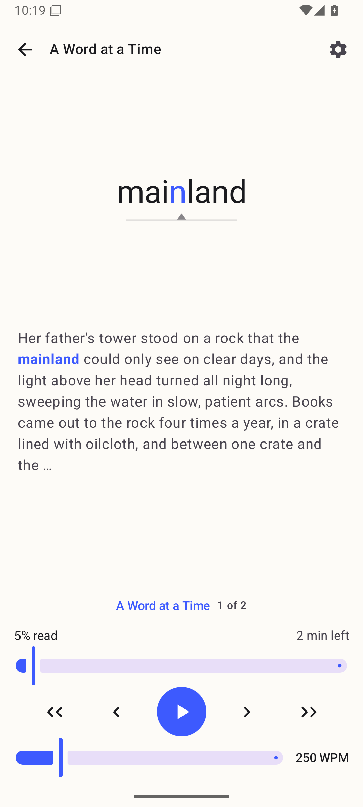
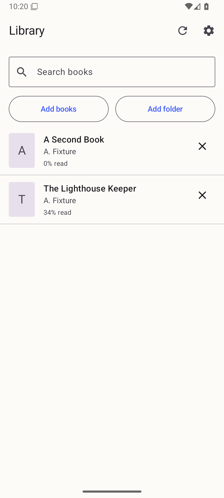
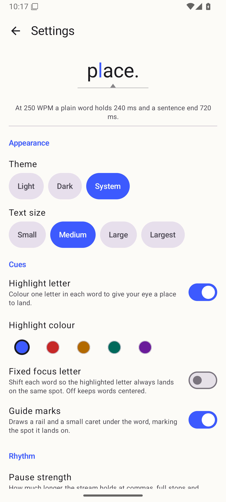
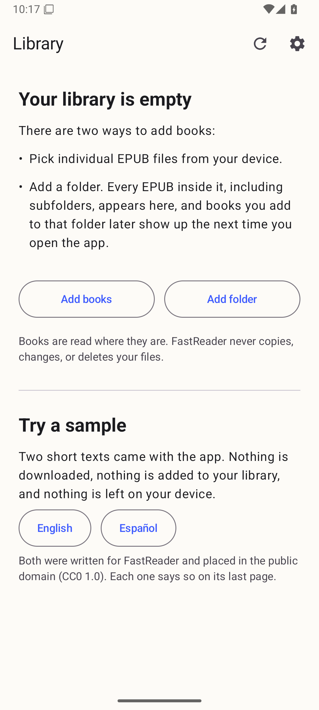

# FastReader

An Android speed reader for EPUB files that are already on your phone. It shows
one word at a time, in place, at a pace you set — no account, no store, no
network.

FastReader has **no internet permission at all**. The APK's manifest declares no
permissions beyond the one Android adds for its own broadcast plumbing, and
`scripts/release.sh` refuses to publish a build in which
`android.permission.INTERNET` ever appears.

## What it looks like

Captured on the reference emulator (`Phone_Mid_API36`, Android 16, 1080p) from
the v1.1.0 release APK.

| Reading | Library | Settings |
| --- | --- | --- |
|  |  |  |

The first screen of a fresh install offers the two bundled sample texts, so you
can see the stream before you go looking for a book:



## Install it

FastReader needs **Android 8.0 (API 26) or newer**. It is not on any store; it
is a signed APK on a GitHub Release.

1. On the phone, open the
   [latest release](https://github.com/cedagova/fastReader/releases/latest) and
   download `fastReader-<version>.apk`.
2. Tap the downloaded file. Android will ask whether the app you downloaded it
   with — your browser or your files app — may install apps; allow it for that
   app.
3. Tap **Install**, then **Open**.

Nothing else is needed: no sign-in, no permission prompt, no first-run setup.

**Updating** is the same three steps with a newer APK. Install it *over* the
installed one — do not uninstall first. Your books, your place in each of them
and your settings are kept; uninstalling throws them away, and so does a
reinstall, because none of that data is included in a backup or a phone-to-phone
transfer.

Every release is signed with the same key, which is what lets Android install
one over the other. **Settings → Check for updates** opens the releases page in
your browser; FastReader itself never checks anything.

## Adding books

Two ways, both from the library screen:

- **Add books** — pick individual EPUB files.
- **Add folder** — every EPUB inside it, subfolders included, appears in the
  library, and books you drop in later show up the next time you open the app.

Books are read where they are. FastReader never copies, changes, or deletes your
files, and removing a book or a folder from the library leaves the files alone.

You can also send an EPUB to FastReader from another app — **Open with** or the
share sheet. That opens the book straight away and remembers your place in it,
but the book is only added to your library when the app that handed it over
grants lasting permission to read it; the Files app does not, so those books are
read for that session and leave no row behind.

## What stays on this device

This is the same statement the app shows under **Settings → What stays on this
device**, word for word — a unit test compares the two so they cannot drift.

<!-- privacy-statement:begin -->
FastReader has no internet permission, so it cannot send or receive anything
itself. Check for updates only hands a web address to your browser, and your
browser makes that request. Your books stay in the folders you chose; on this
device FastReader keeps only its own list of them, your reading positions, your
settings and small cover thumbnails, in its private storage. None of that is
included in this device's backup or in a transfer to a new phone, so a reinstall
or a new phone starts with an empty library. When another app opens a book in
FastReader and does not give lasting permission to read it, that book is not
added to your list and no permission to it is kept; only your place in it is
remembered.
<!-- privacy-statement:end -->

What each sentence rests on, and how it was checked, is in
[docs/privacy-statement.md](docs/privacy-statement.md).

## Personal use, distributed by link

FastReader is **for personal use and distributed by link**. It is not published
to Google Play or any other store, and it is not offered to the public.

That is a deliberate limit, not an oversight. The reader's cue set overlaps a
patent on RSVP presentation, and that is
[an open launch blocker (#33)](https://github.com/cedagova/fastReader/issues/33)
that has to be resolved before FastReader could be published anywhere. Since
v1.0.1 the presentation defaults to plain centered words — the long-standing
prior-art form — and the off-center **Fixed focus letter** alignment is an
opt-in toggle that ships off. Passing the APK to someone who asks for it is
fine; putting it in a store is not, until #33 is closed.

## Build it yourself

```bash
export JAVA_HOME=/opt/homebrew/opt/openjdk@21/libexec/openjdk.jdk/Contents/Home
echo "sdk.dir=$HOME/Library/Android/sdk" > local.properties
./gradlew assembleDebug
./gradlew testDebugUnitTest verifyRoborazziDebug lint
```

Gradle needs **JDK 21**. A debug build needs no signing material; a release
build does, and only the owner has it — see
[docs/release.md](docs/release.md) for the whole release procedure and
[docs/agent-first-development.md](docs/agent-first-development.md) for how the
project is developed and verified.

## Licence

[MIT](LICENSE). The two bundled sample texts were written for FastReader and
placed in the public domain (CC0 1.0); each one says so on its last page.
