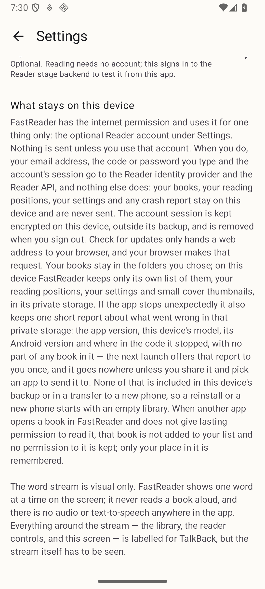
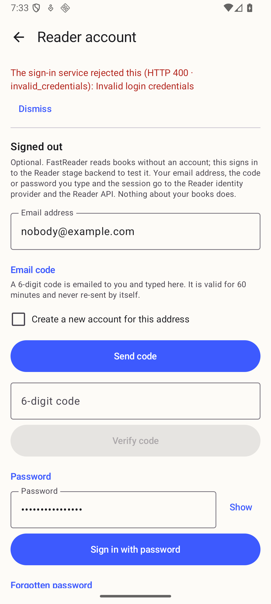
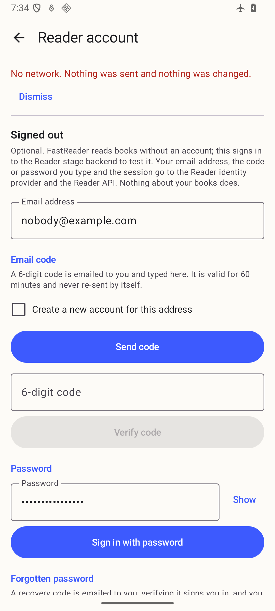
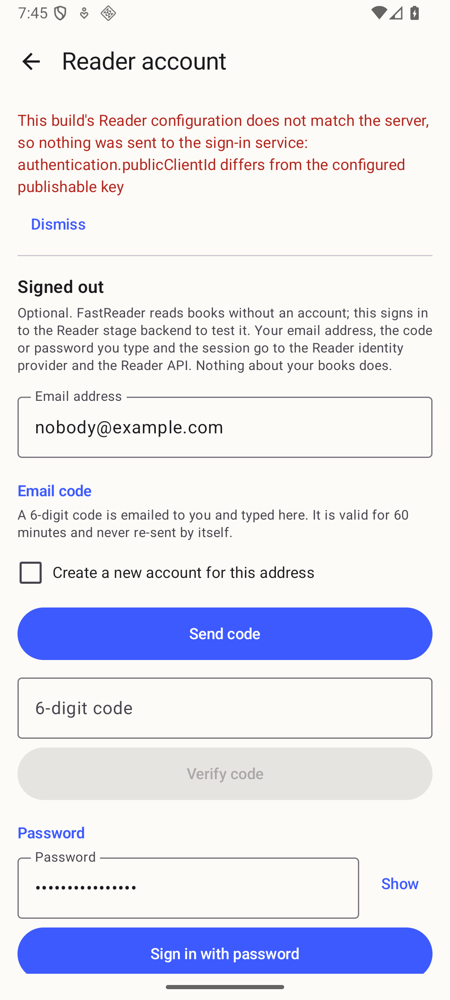
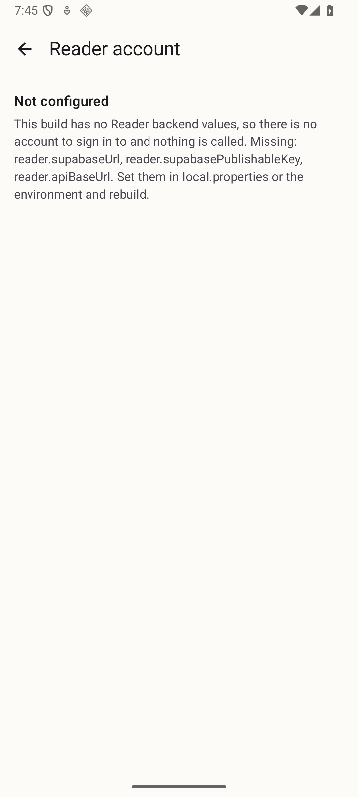

# FastReader signs in to a Reader account through :reader-auth, on a device (#100)

Captured on **`Phone_Mid_API36`** (1080p, Android 16, 420 dpi) on 2026-09-13
from `./gradlew installDebug` of the #100 candidate with the three stage
values (`reader.supabaseUrl`, `reader.supabasePublishableKey`,
`reader.apiBaseUrl`) in the untracked `local.properties`, except where a
build without or with a wrong value is named. No value is reproduced here.
`adb logcat -d -s AndroidRuntime:E` was empty after every step. The retired
host package was uninstalled first; `pm list packages` lists only
`com.cedagova.fastreader`. The exact commands are in
[device-run-phone-mid-api36.txt](device-run-phone-mid-api36.txt).

## Proven without an emailed code (implementer alone)

1. **Signed out, v1.5.0 unchanged (REQ-401, REQ-408).** Launch lands in the
   last-read book as before; play hides every control and shows the word
   alone, pause brings them back; Settings ends with the new row above the
   statement:

   

   

2. **Stage reached, provider rejection (REQ-403, REQ-404).** `nobody@example.com`
   and a wrong password, **Sign in with password**: the library fetched stage
   `GET /v1/reader/pre-auth`, its wiring guard passed, the stage provider's
   `password` grant was rejected, and the surface quotes the provider's code:

   

   The same check was repeated from the signed release APK that
   `scripts/release.sh` built and verified (R8-shrunk), with the same
   answer — see [release-gate-phone-mid-api36.txt](release-gate-phone-mid-api36.txt).

3. **Airplane mode (REQ-404).** `cmd connectivity airplane-mode enable`, the
   same tap: network unavailable, the form intact, nothing cleared:

   

4. **Wrong publishable key (REQ-403).** A build with a wrong
   `reader.supabasePublishableKey`: refused by the wiring guard before any
   provider call, naming the library's reason:

   

5. **Not configured (REQ-401, REQ-412).** A build with no `reader.*` value
   (the hosted runner's situation): the Settings row reads "Not configured",
   the surface names the three missing keys and offers nothing, and
   `run-as com.cedagova.fastreader ls no_backup/` finds no directory at all —
   no client was created, so nothing was called:

   

## The stage acceptance run (owner-relayed code)

IMPLEMENTATION-TODO: the run deferred on 2026-09-13 (`docs/evidence/93/README.md`,
"What was deferred") — sign-up with an emailed code, sign-in with a code and
with a password, recovery with a code and a new password, capabilities with
its request id and a Refresh, `am force-stop` and `adb reboot` survival, sign
out in airplane mode leaving `no_backup/reader-auth/` without `session.bin`,
sign out other devices, and the `docs/evidence/46/` backup procedure moving
zero bytes — needs a person to read the six-digit code from the inbox. It is
recorded here once the owner relays it.
