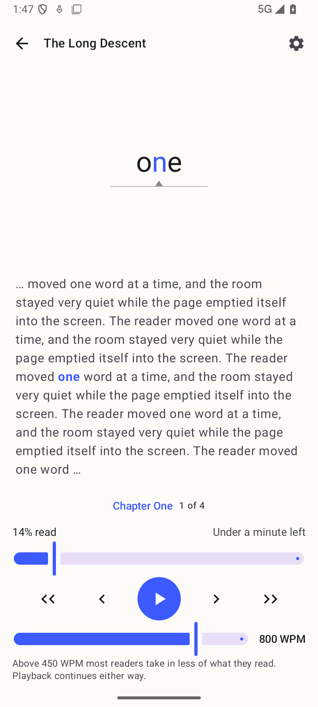
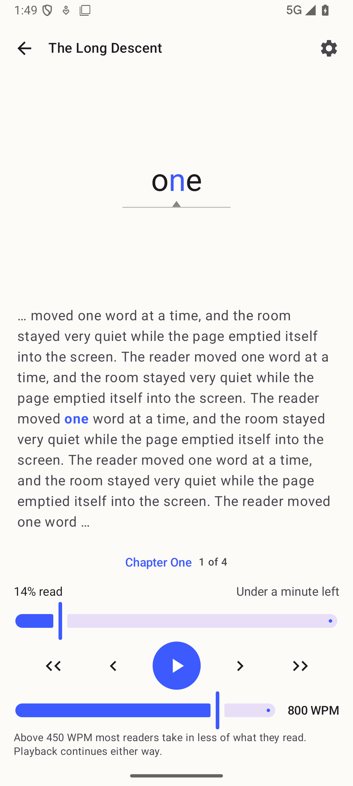

# REQ-110 measurement protocol

How "opening a book takes time proportional to its text, not to its file size"
is measured, so the same numbers can be produced again — on the published
v1.0.1, on this build, and on the published v1.1.0 when #49 re-runs it as a
release gate.

## What is measured

**Tap-to-paused-reader:** from the tap on a book in the library to the reader
standing still on its first word, paused.

Two books, the same protocol:

- **(a)** the owner's largest owned illustrated EPUB, at least 50 MB;
- **(b)** a copy of that same book with its image entries removed and nothing
  else changed.

Two builds, in this order:

1. the **published v1.0.1** APK from its GitHub Release — installed, not built
   locally, so the baseline is the artifact that actually shipped;
2. the build under test.

## Acceptance

On the build under test:

- (a) opens within **25 %** of (b) measured on that same build; and
- neither (a) nor (b) opens slower than its own v1.0.1 recording.

Comparisons are between medians of the same number of runs on the same device.

## Device and state

- **`Phone_Mid_API36`** — the reference AVD (1080p, Android 16). A physical
  phone may be substituted; record which, and use the same one for all four
  measurements.
- Cold process before every run: `am force-stop com.cedagova.fastreader`, then
  launch. This measures opening a book, never resuming a parsed one.
- Both books added to the library beforehand, from the same folder, so ingestion
  (which does still hash the whole file — that is where identity comes from) is
  finished and out of the interval.
- **Warm-up:** open each book once and go back. A cold launch resumes into the
  last-read book (REQ-009), so the script backs out to the library after
  launching; that back press is only correct once a last-read book exists.
- Runs **alternate** between (a) and (b) rather than running all of one then all
  of the other, so neither book gets a systematically warmer file cache.
- **7 runs per book per build**; report the median, and the min/max beside it.

## How the interval is timed

Neither endpoint may depend on a log line, because v1.0.1 emits none and adding
one would change what is being measured. Both are taken on the host:

- **t0** — the moment the tap is injected;
- **t1** — the first screen that is *still* and different from the library. Still
  means the screen's hash repeats over three consecutive captures; t1 is when
  the first of those captures returned.

The paused reader is a still screen, because the stream is a static text swap
and nothing animates once it stops (REQ-302), so "still and not the library"
identifies it without knowing what it looks like.

[`measure-open-time.py`](measure-open-time.py) runs it:

```bash
# tap coordinates of the book's row in the library, on the reference AVD
docs/evidence/43/measure-open-time.py --tap 540 420 --runs 7 --cold \
  --label illustrated-v1.1.0 --out docs/evidence/43/runs
```

`--cold` empties the guest page cache before each run and needs `adb root`.

**The measurement floor is one screen capture, about 130 ms on the reference
AVD.** An interval reported at the floor means "not measurably slower", never
"this fast". If the two books both land on the floor, the device is not
reproducing the cost and the comparison proves nothing — see the recorded runs
below for exactly that happening.

Screen recording was tried first and rejected: the emulator's `screenrecord`
only emits a frame when the screen changes, so an entire open falls between two
frames and the container timings are not wall clock.

## Preparing book (b)

Strip the image entries and change nothing else, so the two files differ only in
the payload REQ-110 is about:

```bash
cp "book.epub" "book-no-images.epub"
zip -d "book-no-images.epub" '*.jpg' '*.jpeg' '*.png' '*.gif' '*.svg' '*.webp'
```

The stripped copy will show `[image skipped]` markers where the plates were and
will report content gaps for any spine item that was itself an image page. That
is expected and does not affect the measurement: both books have the same text.

Note that (b) is a **different file**, so it has a different whole-file SHA-256
and therefore a different catalog id and its own reading position. That is
correct — it is a different book as far as the app is concerned.

## Recorded runs

Per-run numbers live in [`runs/`](runs), one file per label.

### The acceptance measurement has NOT been made

The owner's ≥50 MB illustrated EPUB is a supplied test input and is not in this
repository, so the acceptance pair — that book and its image-stripped copy — has
never been opened by either build. Everything below is a **substitute** over a
synthetic pair, and it does not discharge REQ-110's acceptance.

### What was recorded instead

`Phone_Mid_API36`, 5 cold-cache runs per cell, medians in seconds. Both builds
are release APKs: published v1.0.1 from its GitHub Release, and `assembleRelease`
of this branch. The books are a synthetic 419 MB illustrated EPUB (40 stored,
incompressible plates; 12 chapters of text) and the same book with the plates
removed, 38 kB.

| Build | illustrated 419 MB | stripped 38 kB | apart |
| --- | --- | --- | --- |
| published v1.0.1 | 0.155 | 0.161 | 4 % |
| this branch (release) | 0.154 | 0.154 | 0 % |

Read against the acceptance, this build passes both clauses on this pair: the
two books are 0 % apart (limit 25 %), and neither is slower than its own v1.0.1
recording. **But the comparison is not sensitive**, and saying so matters more
than the numbers: v1.0.1 — which hashes all 419 MB and streams past every plate
— also shows no difference between the two books. Every cell sits on the 130 ms
measurement floor. On this host the emulator's storage is host RAM, so the file
size REQ-110 is about costs nothing to read, and dropping the guest page cache
does not change that.

The one place the cost did surface was the very first open of the 419 MB book on
v1.0.1, before it had ever been read: 1.545 s against 0.155 s for every later
run. That is the effect REQ-110 names, and the reference AVD can only be made to
show it once.

So: a physical device, and the owner's own book, are what the acceptance needs.

A debug build was also measured, and is recorded in `runs/` only to explain why
it must not be compared against a published APK: it opened both books in 0.30 s,
a constant offset over the release build that is the build type and not the
book.

### Positions across the update

Separately from timing, the identity invariant was proven end to end on the same
AVD. On the published v1.0.1: "The Long Descent" read to 14 %, paused on the word
*one*, at 800 WPM. Then this branch's release APK installed **in place** — same
key, `adb install -r`, no data clear — and launched. The reader came back on the
same word, at 14 %, at 800 WPM.





The two captures are two minutes apart on the status-bar clock, and
[`update-in-place-package-state.txt`](update-in-place-package-state.txt) records
what makes the update an update rather than an assertion: `firstInstallTime`
unchanged, `lastUpdateTime` moved, `codePath` pointing at a different APK.

An earlier attempt at this pair produced two byte-identical PNGs and was replaced.
Nothing was staged: the reader screen is pixel-for-pixel the same before and
after — that is the whole point of the test — and both captures happened to fall
inside the same status-bar minute, so `screencap` encoded identical bytes. As
*evidence* it was worthless, because two identical files cannot distinguish
before from after, so the run was redone with the clock deliberately separated
and the package state recorded beside it.

### What is proven without that measurement

The mechanism the measurement depends on is unit-tested exactly, in
`ReaderOpenCostTest`: a channel that throws when an image entry's bytes are
touched still opens the book, and an open reads under a twentieth of an
illustrated file. `ContentPipelineDeviceTest.imageEntriesAreNeverReadOnDevice`
re-proves it on Android's own `Inflater` and channel reads.
