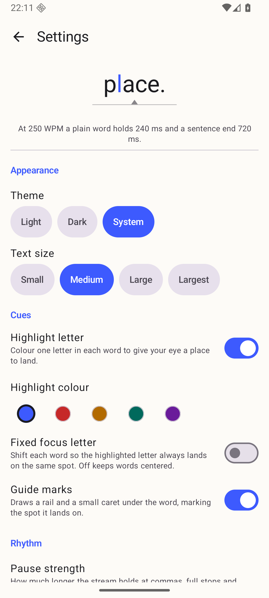
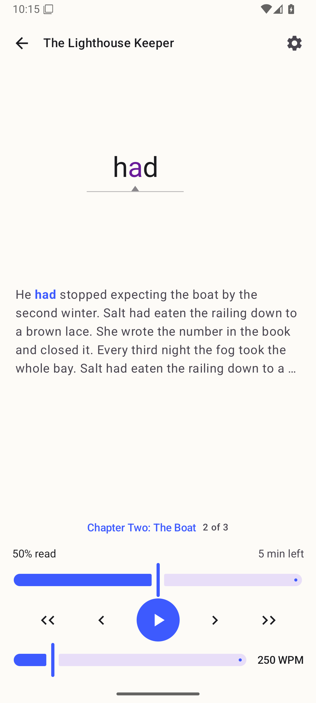
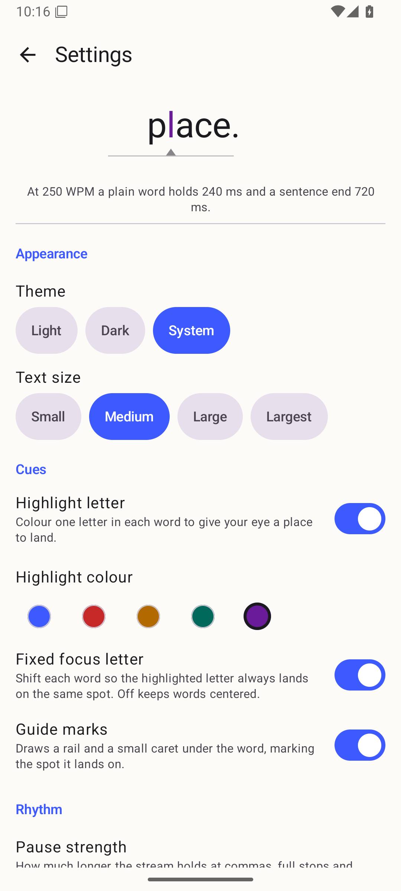
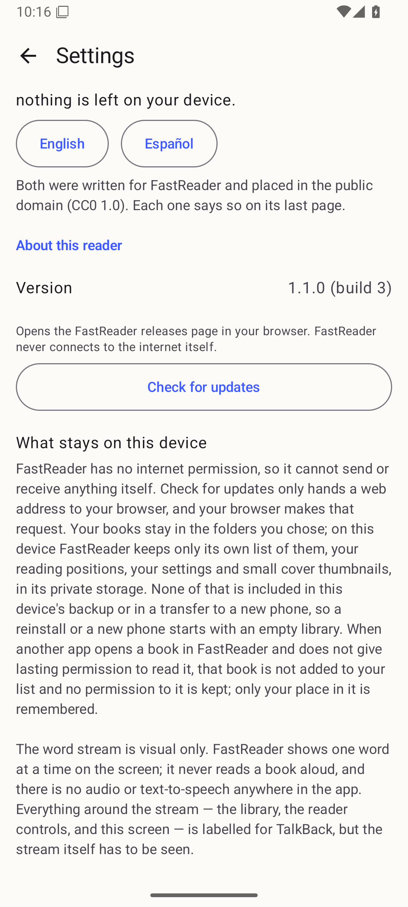

# v1.1.0 release evidence (#49)

Everything here was captured on **`Phone_Mid_API36`** (the reference AVD: 1080p,
Android 16), locale `en-US`, in one session on 2026-09-08.

Two artifacts are involved and they are not the same kind of thing:

- **published v1.0.1** — `fastReader-1.0.1.apk`, downloaded from its GitHub
  Release with `gh release download v1.0.1`. The artifact that actually shipped.
- **v1.1.0 under test** — `fastReader-1.1.0.apk`, built by
  `scripts/release.sh` (no `--publish`) from this branch and signed with the one
  fastReader release key, sha256
  `a96c82fe78cdaa4b25dd0d5c692242a85785a1a80a647b6da5fac05f5a883360`.

**The v1.1.0 release is not published yet.** This branch targets the effort
collector, not `main`, so there is no tag and no release to install from. Every
claim below is about the locally built release-signed APK; the publish-only
gates (tag creation, highest-published-version ordering, and the unauthenticated
re-download of the uploaded asset) can only be run by
`scripts/release.sh --publish` after the collector merges to `main`.

## The cue set is unchanged (REQ-112, D1)

Settings → Cues on a **fresh install of published v1.0.1**:

Settings → Cues on a **fresh install of v1.1.0**, same device, same session:

Same four controls, same states, same defaults: the highlight on, the default
colour selected, **Fixed focus letter off**, guide marks on. The opt-in
alignment is still opt-in.

The other half of REQ-112 — a v1.0.1 reader who turned it on still has it on
after updating — is the update proof below.

## The update keeps everything (AD-12)

Seeded on published v1.0.1: two books added from a folder, *The Lighthouse
Keeper* read to **50 %** (Chapter Two, paused on the word *had*, 250 WPM),
highlight colour changed to **Violet**, and **Fixed focus letter turned on**.

| Before — published v1.0.1 | After — v1.1.0 installed in place |
| --- | --- |
|  |  |
|  |  |
|  |  |

The version row confirms which build is answering, and the privacy statement is
on the same screen:

The reader captures are two screenshots of the same pixels one minute apart —
that is the point of the test — so
[`update-in-place-package-state.txt`](update-in-place-package-state.txt) records
what makes it an update rather than an assertion:

- `firstInstallTime` unchanged at `2026-09-08 22:11:14`;
- `lastUpdateTime` moved to `2026-09-08 22:16:05`;
- `codePath` now a different APK directory;
- the same signer (`PackageSignatures ... signatures:[5b76aa38]`), which is why
  Android allowed the in-place install at all;
- `versionCode` 2 → 3, `versionName` 1.0.1 → 1.1.0.

The install was `adb install -r` — no `-d`, no data clear, no uninstall.

## REQ-110 re-measured on this artifact

The [LEAF503 protocol](../43/req-110-measurement-protocol.md), same device, same
synthetic pair, same 5 cold-cache runs per cell as the recorded v1.0.1 baseline.
Medians in seconds:

| Build | illustrated 419 MB | stripped 38 kB | apart |
| --- | --- | --- | --- |
| published v1.0.1 (recorded in #43) | 0.155 | 0.161 | 4 % |
| **v1.1.0 release APK** | **0.153** | **0.148** | **3 %** |

Both acceptance clauses hold: the two books are 3 % apart (limit 25 %), and
neither is slower than its own v1.0.1 recording.

Per-run numbers:
[`illustrated-419mb-v1.1.0-release-cold.txt`](../43/runs/illustrated-419mb-v1.1.0-release-cold.txt),
[`stripped-38kb-v1.1.0-release-cold.txt`](../43/runs/stripped-38kb-v1.1.0-release-cold.txt).

**The same caveat as #43 applies and matters more than the numbers.** Every cell
sits on the ~130 ms measurement floor, including v1.0.1's, which hashes all
419 MB. On this host the emulator's storage is host RAM, so the file size
REQ-110 is about costs almost nothing to read. This measurement shows "not
measurably slower", not "this fast", and the acceptance pair REQ-110 really
wants — the owner's own ≥50 MB illustrated book, on a physical device — has
still never been opened by either build. What is proven exactly, rather than
statistically, is the mechanism: `ReaderOpenCostTest` and
`ContentPipelineDeviceTest.imageEntriesAreNeverReadOnDevice`.

Re-running this against the **published** v1.1.0 asset, as the issue's
acceptance asks, is part of the post-merge publish.

## Release-script gates that did run

`scripts/release.sh` without `--publish`, on this exact tree, passed all five
artifact gates:

- v2 **and** v3 APK signature schemes present;
- signer certificate SHA-256 equals the pinned
  `d476be8e7efbee3fe81dca8dd89f13c3434f26689a9a6979c01da54629e6485d`, so an
  in-place update over v1.0.1 is possible — and the update above is that
  proven on the device;
- no `android.permission.INTERNET` in the packaged manifest (REQ-050/REQ-303);
- `minSdkVersion` 26 (REQ-040);
- `versionCode=3` / `versionName=1.1.0` match `version.properties`.

Still to run at publish time: the clean-tree/tag-target gate, the
"tag does not already exist" gate, the highest-published-version ordering gate,
and the unauthenticated `curl` re-download of the uploaded asset.
