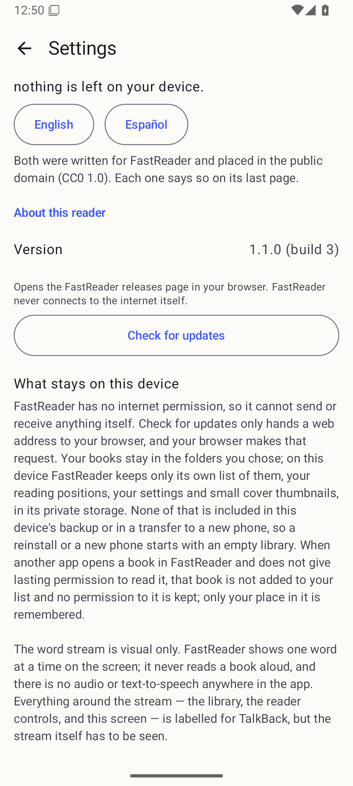
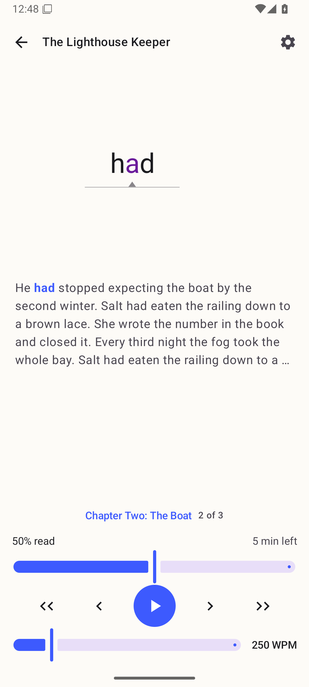
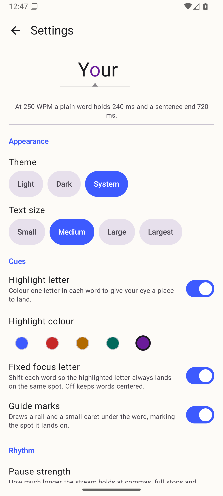
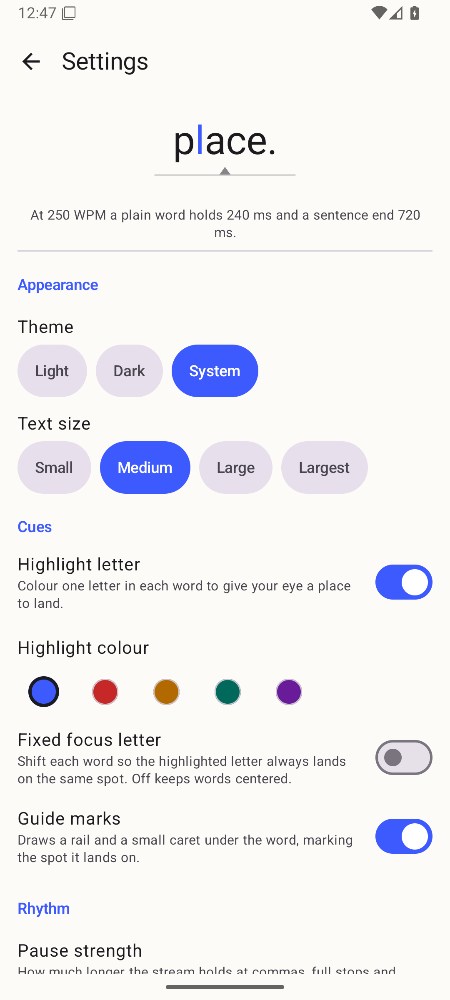

# v1.1.0 published-asset evidence (#49, post-merge)

[`../README.md`](../README.md) proved what could be proved before the collector
merged: a **locally built** release-signed APK. It ends by saying the four
publish-only gates and the REQ-110 re-run "can only be done from `main`, after
merge". This directory is that run.

Everything here was captured on **`Phone_Mid_API36`** (1080p, Android 16),
locale `en-US`, in one session on 2026-09-09, from the two artifacts that are
actually on GitHub:

| Artifact | SHA-256 |
| --- | --- |
| published v1.0.1 — [`fastReader-1.0.1.apk`](https://github.com/cedagova/fastReader/releases/download/v1.0.1/fastReader-1.0.1.apk) | `4a38c2ed2123970e3b2a627de1d28288c4edf945c981e53d761cd0492eea0309` |
| published v1.1.0 — [`fastReader-1.1.0.apk`](https://github.com/cedagova/fastReader/releases/download/v1.1.0/fastReader-1.1.0.apk) | `de9c8af7df620f81c66e2caf7d9ff7dd367052d171d35c0b22fc72c2ba5655d2` |

Both were fetched with `gh release download`. The v1.1.0 digest is the same one
`scripts/release.sh` printed for the artifact it built and uploaded, so the file
tested below is the file a stranger downloads.

## The release itself

Tag [`v1.1.0`](https://github.com/cedagova/fastReader/releases/tag/v1.1.0)
points at `63bd366d90a2c0790f9e3e95c39808f74e020668` — the `main` merge commit
of collector PR #57. `scripts/release.sh --publish --notes-file
docs/release-notes/v1.1.0.md` ran the five artifact gates and the four
publish-only gates in one pass:

- clean worktree, and the tag created on that exact `HEAD`;
- the tag did not already exist;
- highest published stable version was `1.0.1`, so `1.1.0` sorts strictly above it;
- the uploaded asset re-downloaded with plain `curl` — no token, no cookies —
  `HTTP 200`, compared byte-for-byte against the verified artifact, and the
  downloaded copy re-checked against the pinned signing certificate.

**Version equals tag:** the About row reads `1.1.0 (build 3)` and the tag is
`v1.1.0`.

## The update keeps everything (AD-12, REQ-112, REQ-113)

Fresh install of **published v1.0.1**, then seeded: a folder of two books added,
*The Lighthouse Keeper* read to **50 %** (Chapter Two, paused on *had*, 250 WPM),
highlight colour **Violet**, **Fixed focus letter on**. Then **published v1.1.0**
installed over it with `adb install -r` — no `-d`, no uninstall, no data clear.

| Before — published v1.0.1 | After — published v1.1.0 in place |
| --- | --- |
|  |  |
|  |  |
|  |  |

The library gains one row that is not a book — "Added folders (1)", #45's folder
list. That is the only visible difference, and it is new v1.1.0 UI, not a change
to the catalogue.

### The cue set is unchanged (REQ-112, D1)

Settings → Cues on a **fresh install of published v1.0.1**, before anything was
touched: highlight letter on, Highlight colour Default, **Fixed focus letter
off**, guide marks on.

Same four controls, same defaults on published v1.1.0 — see
[`../README.md`](../README.md) for the fresh-install v1.1.0 capture. The other
half of REQ-112, that a reader who *turned it on* still has it on, is the
Settings pair above.

### Nothing migrated, and the file says so

The whole catalogue — books, folders, reading positions and settings — is one
file, `files/catalog/catalog.json`. It was copied off the device before and
after the update:

- [`catalog-before-v1.0.1.json`](catalog-before-v1.0.1.json)
- [`catalog-after-v1.1.0.json`](catalog-after-v1.1.0.json)

`schemaVersion` is **4 on both sides**, so no migration ran at all. Compared
field by field, the two files are **identical once `*EpochMs` timestamps are
ignored** — same two book ids, same folder, same `lastReadBookId`, byte-equal
`settings` (`pivotColor: VIOLET`, `focusAlignmentEnabled: true`), and a reading
state whose `tokenIndex` (1043), `progressFraction` (0.5) and `wpm` (250) are
unchanged. Only the "last seen / last scanned / updated at" stamps moved, which
is v1.1.0's launch rescan touching the same rows.

[`update-in-place-package-state.txt`](update-in-place-package-state.txt) records
what makes this an update rather than an assertion: `firstInstallTime` unchanged
at `2026-09-09 12:45:09`, `lastUpdateTime` moved to `12:49:50`, `codePath` now a
different APK directory, `versionCode` 2 → 3, and the **same signer**
(`signatures:[5b76aa38]`) — which is why Android allowed the in-place install.

`adb logcat -s AndroidRuntime:E` was empty for the whole session.

## REQ-110 re-measured on the published asset

The [LEAF503 protocol](../../43/req-110-measurement-protocol.md), same device,
same synthetic pair, same 5 cold-cache runs per cell as the recorded v1.0.1
baseline. Medians in seconds:

| Build | illustrated 419 MB | stripped 38 kB | apart |
| --- | --- | --- | --- |
| published v1.0.1 (recorded in #43) | 0.155 | 0.161 | 4 % |
| v1.1.0 release APK, built locally (#49) | 0.153 | 0.148 | 3 % |
| **published v1.1.0 asset** | **0.147** | **0.150** | **2 %** |

Both acceptance clauses hold on the published artifact: the two books are 2 %
apart (limit 25 %), and neither is slower than its own v1.0.1 recording
(0.147 < 0.155 and 0.150 < 0.161).

Per-run numbers:
[`illustrated-419mb-published-v1.1.0-cold.txt`](../../43/runs/illustrated-419mb-published-v1.1.0-cold.txt),
[`stripped-38kb-published-v1.1.0-cold.txt`](../../43/runs/stripped-38kb-published-v1.1.0-cold.txt).

**The caveat from #43 and #49 is unchanged and still matters more than the
numbers.** Every cell sits on the ~130 ms measurement floor, including v1.0.1's,
which hashes all 419 MB. On this host the emulator's storage is host RAM, so the
file size REQ-110 is about costs almost nothing to read. This shows "not
measurably slower", not "this fast". The acceptance pair REQ-110 really wants —
the owner's own ≥50 MB illustrated book, on physical hardware — has still never
been opened by any build, and no repository fixture can stand in for it.
