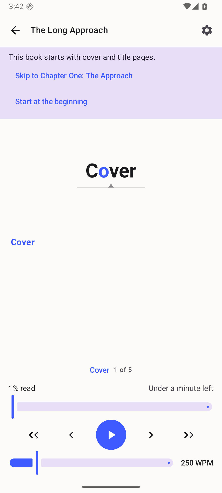
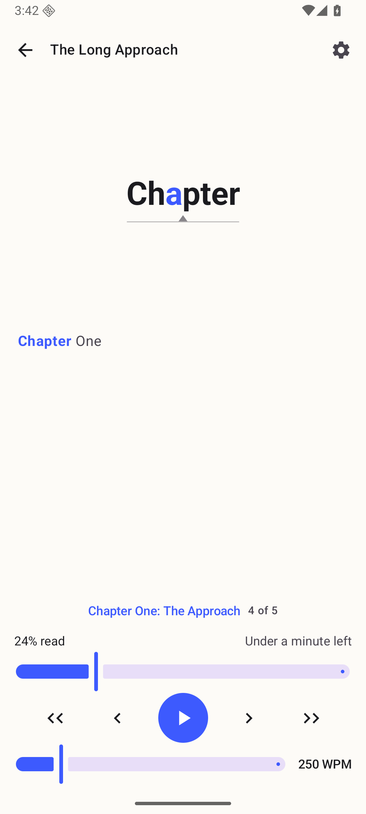
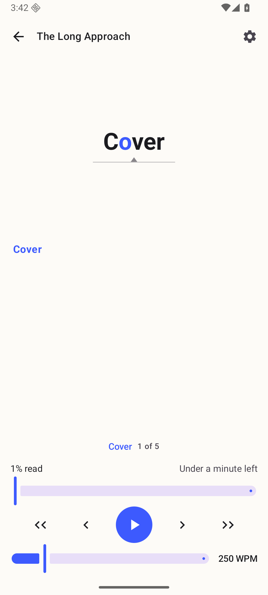
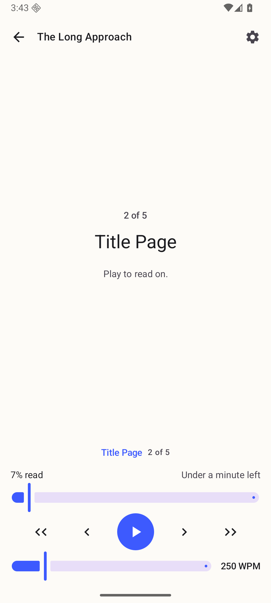
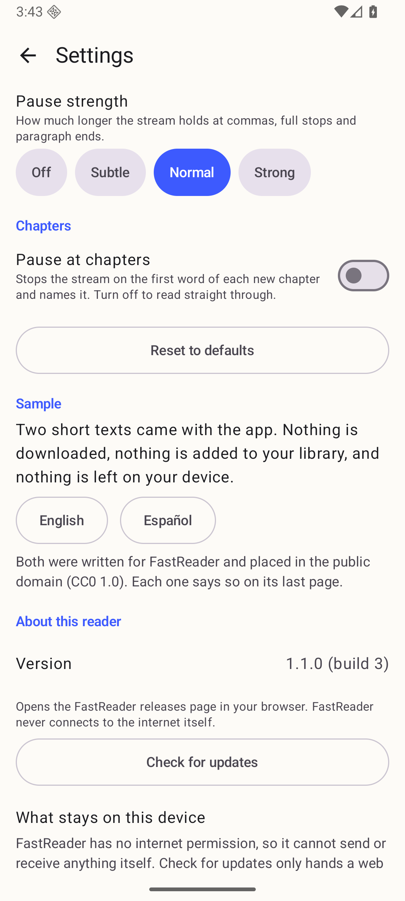
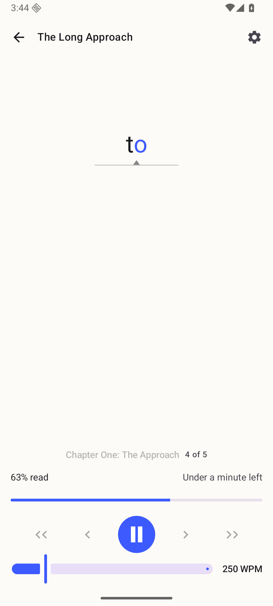

# Chapter control on a device (#51)

Everything here was captured on **`Phone_Mid_API36`** (the reference AVD: 1080p,
Android 16, 420 dpi), locale `en-US`, in one session on 2026-09-09, from a
`./gradlew installDebug` of **`9c75c02c518f90906519cd39c5d60bff4f35a2d5`** — the
parent of the commit that adds these files, since a commit that only adds
pictures cannot have produced them.

The book is `the-long-approach.epub`, a five-item spine — cover, title page,
copyright, Chapter One, Chapter Two — built for this run and pushed to
`/sdcard/Download/leaf51/`, then added through the app's own **Add books**
picker so it arrives over a real Storage Access Framework URI. It declares
**neither** an EPUB 3 `landmarks` `bodymatter` entry **nor** an EPUB 2
`<guide><reference type="text">`, so this run exercises the weakest of the three
detection paths: the chapter-title heuristic alone.

## REQ-202 — the offer, once

First open of the book. The reader is on the cover, chapter 1 of 5:

Taking the skip. The word on screen is "Chapter" — the first word of Chapter
One — and the chapter readout says 4 of 5:

Then the position was scrubbed back to the book's first word, the process was
killed with `am force-stop`, and the app was relaunched. It resumes into the
book **on the cover, 1 of 5 — and makes no offer**:

Nothing in memory survived the force-stop, so the only thing that can be
suppressing the offer at token zero is the stored record. It is in the catalog
below.

## REQ-201 — the chapter pause, both ways

**On (the default, v1's behaviour).** Playing from the cover stops the stream on
the first word of the title page and names it:

**Turned off** in Settings → Chapters. Note that "Reset to defaults" has become
enabled, so the change is a real departure from the shipped defaults:

Playing again from the book's first word. The stream crossed **three** chapter
boundaries — cover to title page, title page to copyright, copyright to Chapter
One — without stopping at any of them, and is still running inside Chapter One
at 63%:

## What was stored

[catalog-schema-5-phone-mid-api36.txt](catalog-schema-5-phone-mid-api36.txt) —
the catalog the debug build wrote, read back with `run-as`. Schema version 5,
`chapterPauseEnabled: false` (the setting turned off above), and the book's id
in `frontMatterOfferedBookIds`.

`adb logcat -d -s AndroidRuntime:E` was empty for the whole session.
