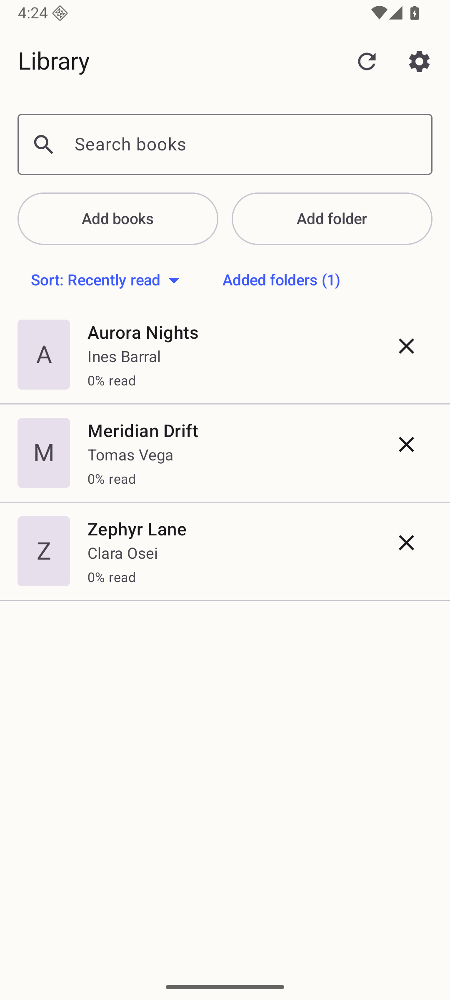
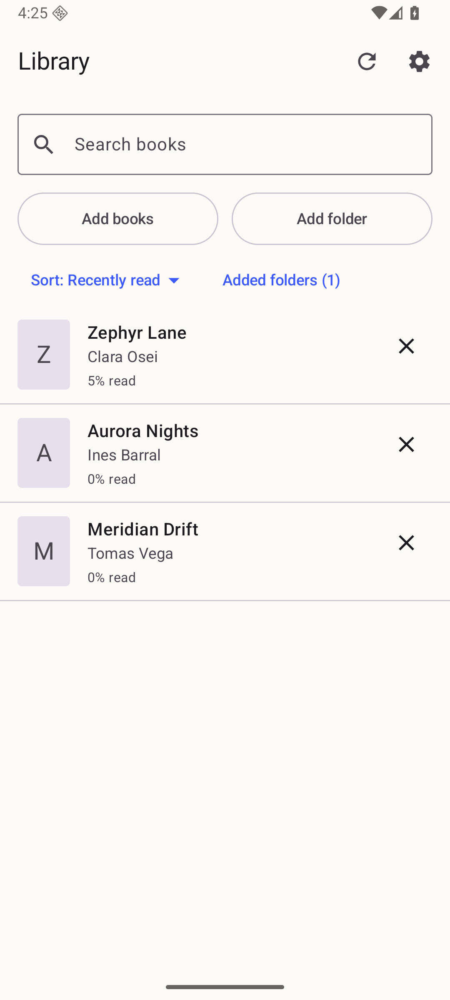
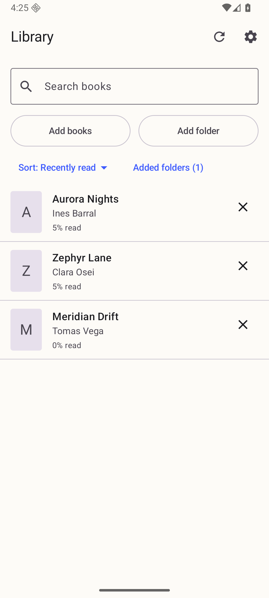
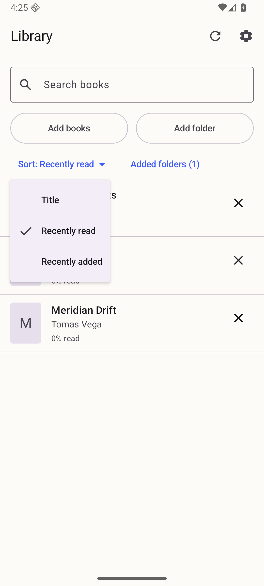
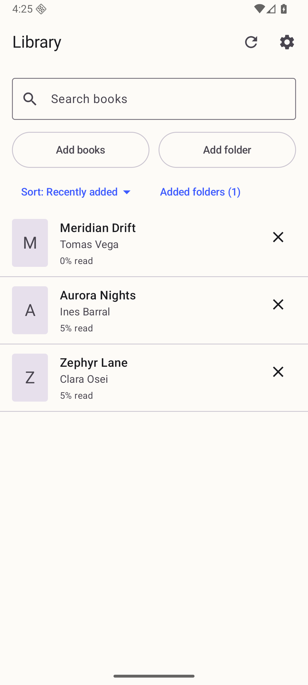
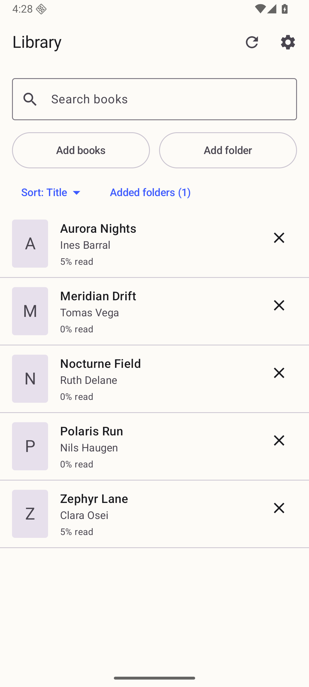
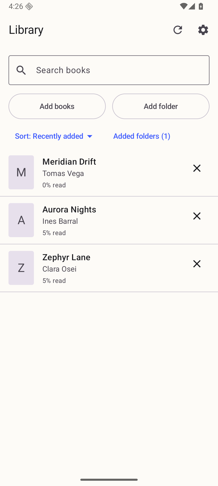
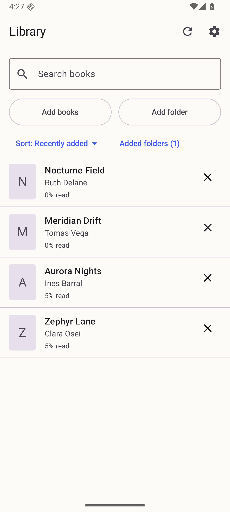
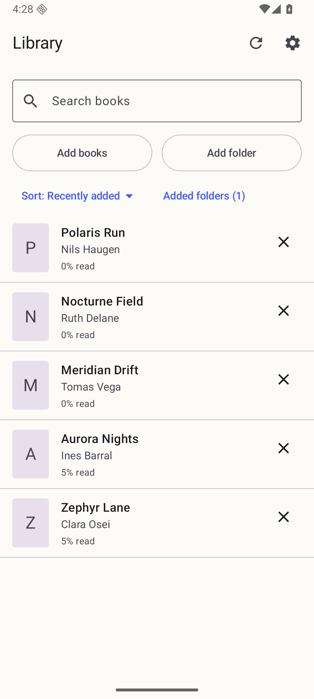
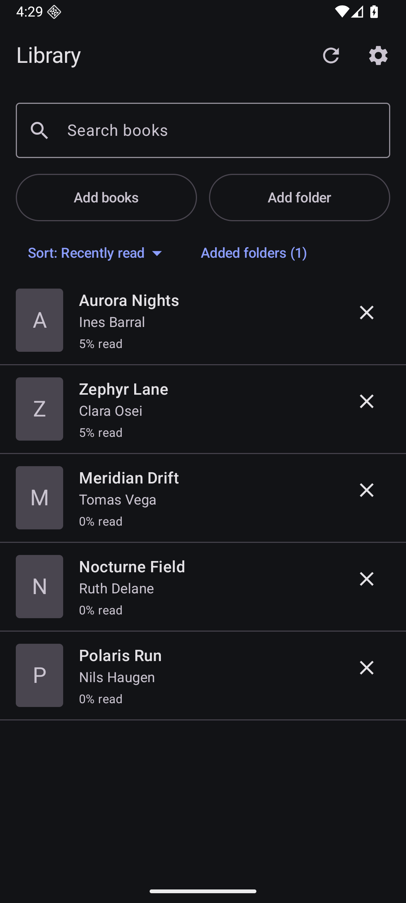

# Library order and return-to-app rescan on a device (#52)

Everything here was captured on **`Phone_Mid_API36`** (the reference AVD: 1080p,
Android 16, 420 dpi), locale `en-US`, in one session on 2026-09-09, from a
`./gradlew installDebug` of **`d3feef317d667fce0c33b2b76cc98de992f8ec22`** — the
parent of the commit that adds these files, since a commit that only adds
pictures cannot have produced them.

The library is five two-chapter EPUBs built for this run and copied into
`/sdcard/Download/leaf52/`, which was then added through the app's own **Add
folder** picker so it arrives over a real Storage Access Framework tree URI.
They were added in stages, and two of them were read, so that all three orders
disagree with each other and no capture could be mistaken for another:

| Book | Added | Read |
| --- | --- | --- |
| Zephyr Lane | 1st | 2nd |
| Aurora Nights | 2nd | 3rd (last) |
| Meridian Drift | 3rd | never |
| Nocturne Field | 4th | never |
| Polaris Run | 5th | never |

## REQ-203 — reading a book moves it up

Three books, none of them opened yet. The order is the default, **Recently
read**, and with nothing read it falls back to the alphabet — Zephyr Lane is
last:

Zephyr Lane was then opened and played for a few seconds — the acceptance's
"two words" and then some — and the library returned to. It is now **first**,
above the two books that were never opened:

Reading Aurora Nights next puts it above Zephyr Lane, and the book still never
opened stays at the bottom. Both halves of the rule are on screen: read books
in order of when they were read, then everything never read:

## REQ-203 — the three orders, and REQ-301

The control, open. Three entries, a tick on the one in force, and the button
itself says which order is on without opening anything:

**Recently added** — exactly the reverse of the order these books were added
in, and unlike either other order:

**Title** — v1's list, back:

TalkBack is not visible in a screenshot; the label the control actually
announces ("Sort books. Currently Recently read."), the 48 dp target and the
menu's selected state are asserted against the semantics tree in
`LibraryOrderAccessibilityTest`.

## REQ-203 — the choice survives a restart

With **Recently added** chosen, the process was killed with
`am force-stop com.cedagova.fastreader` and the app relaunched. Nothing of the
old process survived, so the header can only be reading the stored catalog:

## REQ-204 — returning within the interval does not re-list the folders

The picture above is also the *before* of this test. Four seconds after that
scan finished, the reader left the app, a fourth EPUB (`nocturne-field.epub`)
was copied into the added folder, and the app was reopened — all inside the
60 s interval. The screen that came back is **byte-for-byte the same image**
(`sha1 eb054ee5…` for both): three books, no Nocturne Field, and no scanning
banner. Nothing was scanned and nothing was announced.

The full sequence with wall-clock times, the `ls` of the folder showing the new
file already on disk, and the commands used is in
[req-204-app-switch-timeline-phone-mid-api36.txt](req-204-app-switch-timeline-phone-mid-api36.txt).

Then the refresh control was tapped. It always runs, and it finds the new book —
at the top, because the order is still Recently added:

The interval throttles the app-open rescan rather than switching it off. A fifth
EPUB was copied in with the app backgrounded, and the app reopened 95 seconds
after the last scan — past the interval. Polaris Run is there with no refresh
tapped:

## AD-16 — the schema step, on the device

The stored catalog after the run is transcribed in
[catalog-schema-6-phone-mid-api36.txt](catalog-schema-6-phone-mid-api36.txt):
`schemaVersion 6`, `libraryOrder: "TITLE"`, and the two v1 timestamps the orders
are computed from. No per-book field was added.

That document was then edited into a v1.1.0-shaped one — `schemaVersion 5`, no
`libraryOrder`, the chapter pause turned **off** and the theme set to **dark** —
and written back over the app's catalog with the process stopped. The next
launch migrated it: the library came up ordered by **Recently read**, the two
positions intact, and both of the reader's own choices kept.

