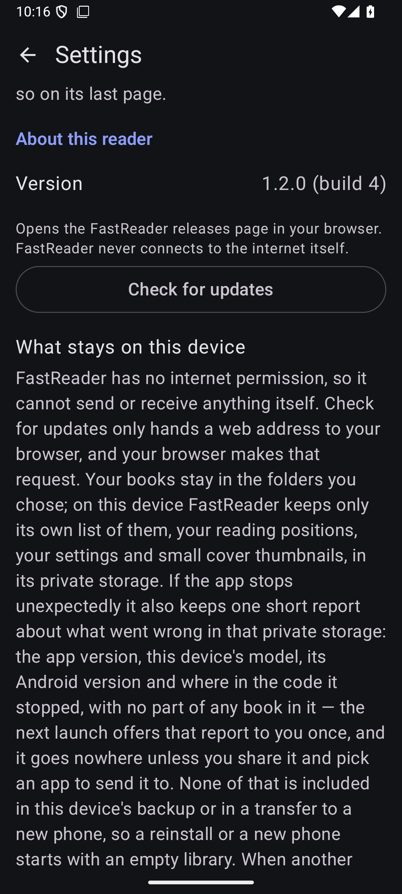
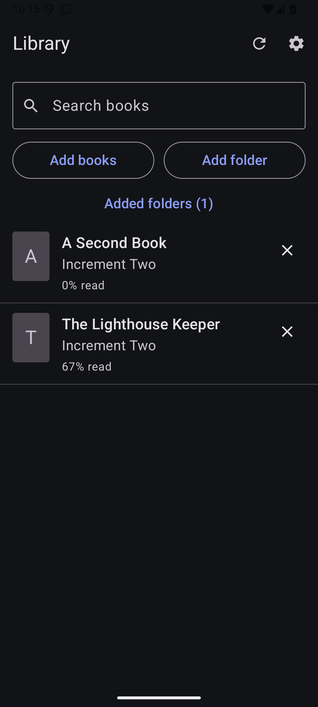
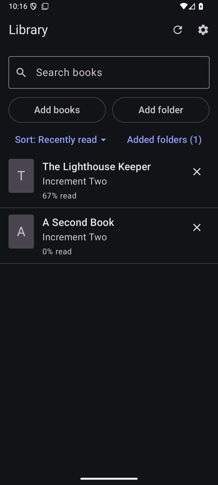
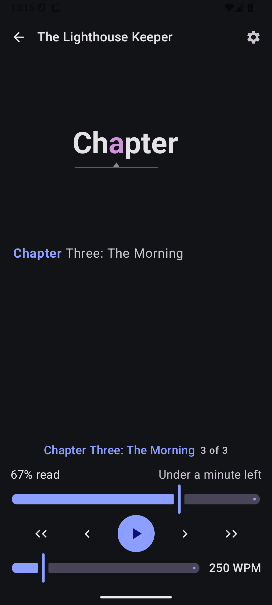
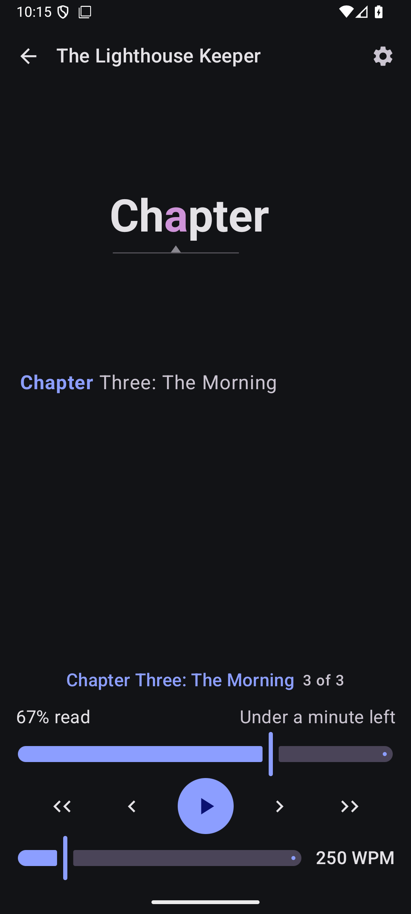
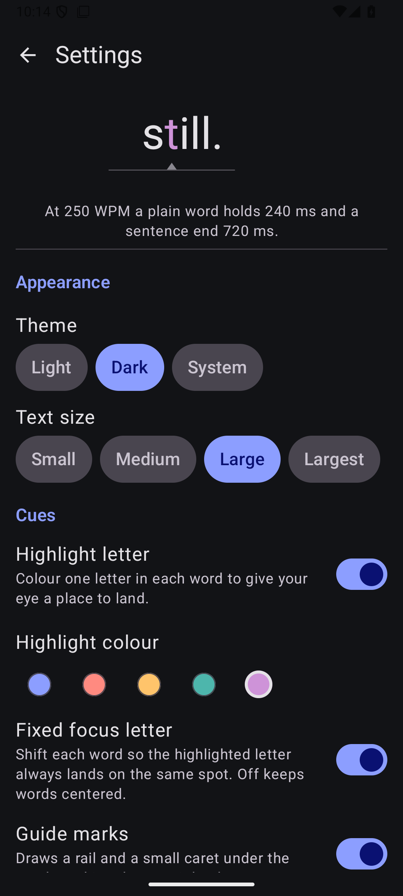
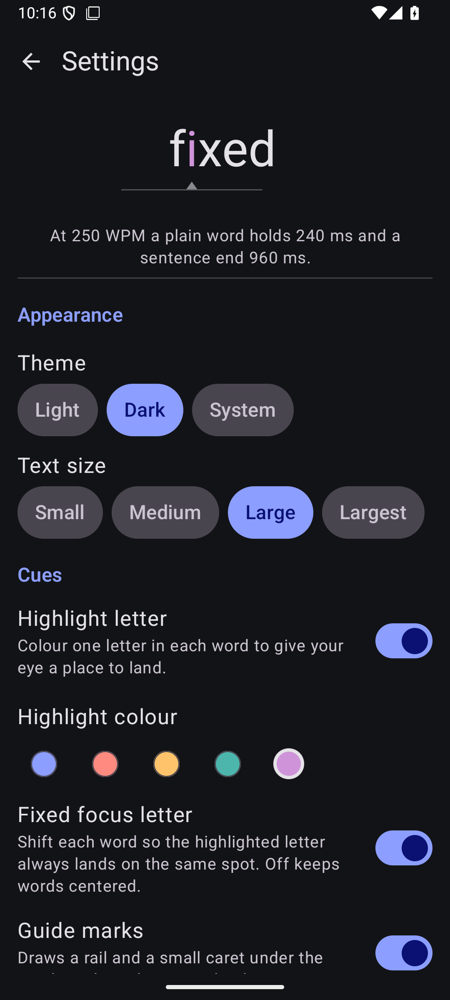
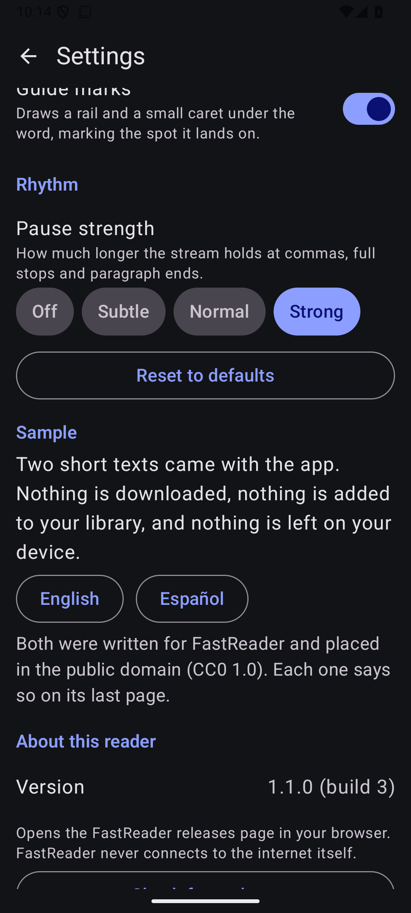
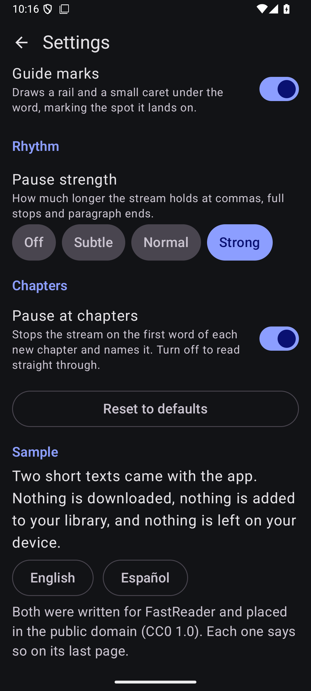

# v1.2.0 published-asset evidence (#56, post-merge)

[`../README.md`](../README.md) proved what could be proved before the collector
merged: the update worked against a **locally built** release-signed APK. It
ends by listing what could not run without a publish — the four publish-only
gates, and the "version equals the tag" comparison. This directory is that run,
from `main`.

Everything here was captured on **`Phone_Mid_API36`** (Android 16 / API 36,
`sdk_gphone64_arm64`, 1080x2400, density 420), locale `en-US`, in one session on
2026-09-10, from the two artifacts that are actually on GitHub:

| Artifact | Bytes | SHA-256 |
| --- | --- | --- |
| published v1.1.0 — [`fastReader-1.1.0.apk`](https://github.com/cedagova/fastReader/releases/download/v1.1.0/fastReader-1.1.0.apk) | 1,778,275 | `de9c8af7df620f81c66e2caf7d9ff7dd367052d171d35c0b22fc72c2ba5655d2` |
| published v1.2.0 — [`fastReader-1.2.0.apk`](https://github.com/cedagova/fastReader/releases/download/v1.2.0/fastReader-1.2.0.apk) | 2,047,816 | `6a9303cf164ad30c51a036466c1a6110890641f600c2d89dfdb7c84a0acec91c` |

v1.1.0 came from `gh release download`; v1.2.0 was fetched with plain `curl`
from the public asset URL, no token. The v1.2.0 digest is the one
`scripts/release.sh` printed for the artifact it built and uploaded, so the file
tested below is the file a stranger downloads. It is **not** the digest in
[`../README.md`](../README.md) (`e0d1809d…`): that was a different build, of a
different commit, before the coordinator's `docs/evidence/39/` commit existed.
Same length, same key, same gates.

## The release itself

Tag [`v1.2.0`](https://github.com/cedagova/fastReader/releases/tag/v1.2.0)
points at `bc1388f638246b81eaec54615b69b8eb99e1a400` — the `main` merge commit
of collector PR #69. `scripts/release.sh --publish --notes-file
docs/release-notes/v1.2.0.md` ran the five artifact gates and the four
publish-only gates in one pass:

- clean worktree, and the tag created on that exact `HEAD`
  (`target commit: bc1388f6…`);
- the tag did not already exist;
- `highest published stable version: 1.1.0`, so `1.2.0` sorts strictly above it;
- the uploaded asset re-downloaded with plain `curl` — no token, no cookies —
  `HTTP 200`, compared byte-for-byte against the verified artifact, and the
  downloaded copy re-checked against the pinned signing certificate
  `d476be8e…485d`.

The five artifact gates on the same run: v2 **and** v3 signature schemes
present, signer certificate equal to the pinned key, **no**
`android.permission.INTERNET` (the only `uses-permission` line is Compose's own
`DYNAMIC_RECEIVER_NOT_EXPORTED_PERMISSION`), `minSdkVersion 26`, and
`versionCode='4' versionName='1.2.0'` matching `version.properties`.

**Version equals tag:** the About row reads `1.2.0 (build 4)` and the tag is
`v1.2.0`.



Distribution is the GitHub Release link only. There is no store or catalogue
listing — see issue #33 and definition decision D6.

## The update keeps everything, and the new settings arrive at their defaults

Fresh install of **published v1.1.0**, then seeded through the app's own UI: one
folder of two EPUBs added over a real Storage Access Framework grant,
*The Lighthouse Keeper* read to **67 %** (Chapter Three of 3, token 88,
250 WPM), theme **Dark**, text size **Large**, highlight colour **Violet**,
**Fixed focus letter on**, pause strength **Strong**. Then **published v1.2.0**
installed over it with `adb install -r` — no `-d`, no uninstall, no data clear.

| Before — published v1.1.0 | After — published v1.2.0 in place |
| --- | --- |
|  |  |
|  |  |
|  |  |
|  |  |

The v1.2.0 app resumed **straight into the reader** on the word it was left on.
That capture is the first launch after the update, one minute after the v1.1.0
one; the only differences a reader can see are the clock and the two new
controls.

### The library order default is doing real work

The two books were added together and only *The Lighthouse Keeper* was read, so
title order and recently-added order both put *A Second Book* first — which is
exactly what v1.1.0 shows, because v1.1.0 has one fixed order and no control.
After the update the list is *The Lighthouse Keeper* first, under
`Sort: Recently read`. That ordering is reachable only from "recently read", so
the default is not agreeing with the old order by luck.

## The catalog: 4 → 7 in one load

The whole catalog — books, folders, reading positions and settings — is one
file, `files/catalog/catalog.json`, copied off the device before and after with
`adb root` (both sides are release builds, so neither is debuggable and
`run-as` is unavailable):

- [`catalog-before-v1.1.0.json`](catalog-before-v1.1.0.json) — `schemaVersion` **4**
- [`catalog-after-v1.2.0.json`](catalog-after-v1.2.0.json) — `schemaVersion` **7**

One open walked the whole chain: 4 → 5 (#51's chapter pause), 5 → 6 (#52's
library order), 6 → 7 (#62's structural fingerprint).

**Nothing the reader chose moved.** Every settings field that existed on both
sides is identical — `DARK`, `LARGE`, `highlightEnabled` true,
`focusAlignmentEnabled` true, `VIOLET`, `guideMarksEnabled` true, `STRONG` — as
are both book ids, `lastReadBookId`, and the reading state's `tokenIndex` **88**,
`progressFraction` **0.67424244** and `wpm` **250**. No settings field was
removed and none changed value.

**The two new settings arrive at their defaults, not as blanks.** The after
catalog gains exactly two settings fields:

```json
"chapterPauseEnabled": true,
"libraryOrder": "RECENTLY_READ"
```

which is REQ-208's second clause, and what the Chapters row and the
`Sort: Recently read` button show on screen.

**#62's fingerprint is written on the first open after the migration, not
during it.** The migrated reading state gains
`"structuralFingerprint": "zipdir1:f3877e96…"` beside an unchanged `bookDigest`,
which is AD-18's write-path rule: the migration installs the default and the
first directory open fills it in.

## It is an update, not a reinstall

[`update-in-place-package-state.txt`](update-in-place-package-state.txt) is
`dumpsys package` either side: `firstInstallTime` unchanged, `lastUpdateTime`
moved, `codePath` new, the signer byte-identical, `versionCode` 3 → 4 and
`targetSdk` 36 → 37.

## No crash

`adb logcat -d -s AndroidRuntime:E` over the whole post-install session is
empty, and a full-buffer search for `FATAL EXCEPTION` returns zero lines. The
app's private storage after the run holds only `catalog/` and the two
profile-installer files — no crash report was written, which is the correct
state for a session that did not crash.
