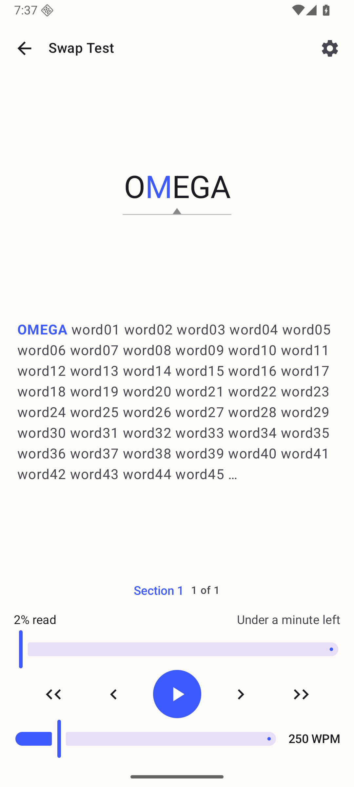
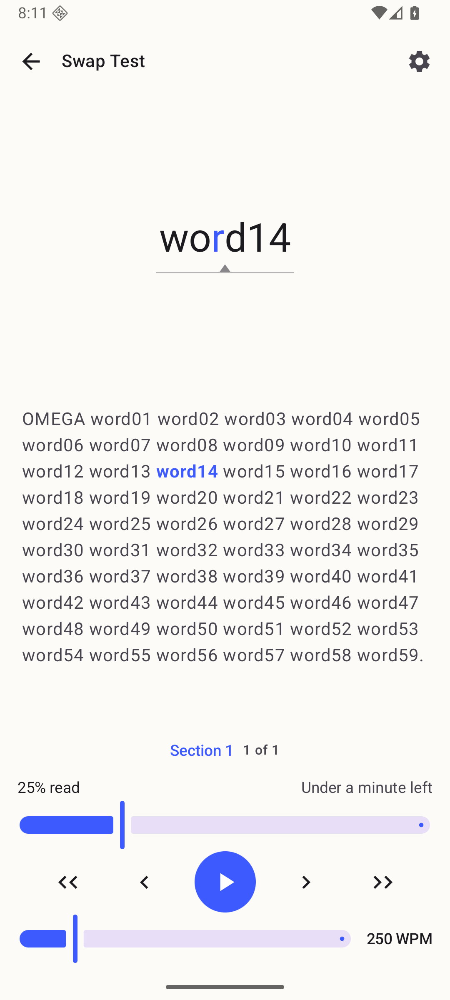
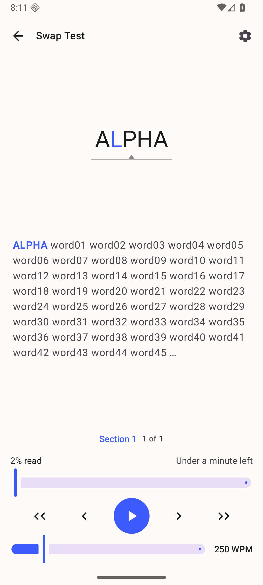

# The content-change guard on a device (#62)

Everything here was captured on **`Phone_Mid_API36`** (the reference AVD: 1080p,
Android 16, 420 dpi), locale `en-US`, in one session on 2026-09-09, from a
`./gradlew installDebug` of **`e710a135d18605747268b09e8363ff89efa8dff3`** — the
parent of the commit that adds these files, since a commit that only adds
pictures cannot have produced them.

## The fixture, and why it is built the way it is

One book, `swap-test.epub`, in `/sdcard/Download/leaf62/`, added through the
app's own **Add folder** picker so it arrives over a real Storage Access
Framework tree URI. Its chapter is sixty words: a marker word, then `word01`
through `word59`. The marker is the only thing that differs between the two
versions of the file — **`ALPHA`** before the swap, **`OMEGA`** after — so a
single screenshot of the reader says which file is open *and* which word the
position resolved to.

Every entry is **STORED**, so the chapter text sits in the archive as plain
bytes. `ALPHA` → `OMEGA` is a five-byte substitution of the same length, with
the entry's CRC-32 patched in both the local and the central header. The two
files are therefore **the same length to the byte**, and `touch -t` puts the
last-modified time back. That matters: the rescan fingerprint
(`BookSource.matchesFingerprint`) is size plus last-modified, and it is the only
reason `CatalogIngestor` skips re-inspection. Holding both constant is what
makes this evidence prove *this* guard rather than the rescan re-keying the book.

| | before the swap | after the swap |
| --- | --- | --- |
| size | 1801 | 1801 |
| last-modified | 1598983200 | 1598983200 |
| md5 | `3c4e671c…` | `11760b68…` |
| whole-file SHA-256 (book identity) | `aad0b203…` | `c6df75e7…` |
| structural fingerprint | `zipdir1:a8dd8d04…` | `zipdir1:33c9a4b5…` |

Only twelve bytes differ between the two files: four for the substituted text,
and the two four-byte copies of that entry's CRC-32.

The generator and the full command transcript with wall-clock times are in
[swap-transcript.txt](swap-transcript.txt).

## Seeding a position

The book was opened and played for seven seconds at the default 250 WPM, then
paused. Word 14, 25% read, with `ALPHA` at the head of the context line:


Returning to the library wrote the position, and the guard was armed by the same
open that produced it — the fingerprint stored beside the index is the one the
central-directory read had already computed:

```json
"sha256:aad0b203…": {
  "bookDigest": "sha256:aad0b203…",
  "tokenIndex": 14,
  "pipelineVersion": 1,
  "structuralFingerprint": "zipdir1:a8dd8d0495e124e07ca1a8f085f4b7f00ee496d2d6f1e59838ac9ef2cae31274",
  "progressFraction": 0.25, "wpm": 250
}
```

`schemaVersion` is **7**. That stored value is byte-for-byte what an independent
re-implementation of the documented encoding produces from `original.epub`, which
is what says the digest really is taken over the archive directory's per-entry
names, uncompressed sizes and CRC-32 values and nothing else.

## The control: an unchanged file resumes

Reopening without touching anything resumes exactly where it was — word 14, 25%,
`ALPHA` still first. Recomputing a fingerprint on every open costs a position
nothing when the file has not moved:


## The swap: the file changes under the position

The app was force-stopped, `swapped.epub` was written over the same path — the
same document URI, the same size, the same last-modified — and the app
relaunched cold.

The reader restarts at word 0, and the word on screen is **`OMEGA`**: the new
file's first word, at 2% read instead of 25%:



### Why the rescan cannot be what caught it

The relaunch happened more than 60 s after the previous scan, so the app-open
rescan **did run** — the folder's `lastScannedEpochMs` moved from
`1789004130839` to `1789004271603`. It found the size and last-modified
unchanged and skipped re-inspection, exactly as `CatalogIngestor` is meant to:

- the book's id stayed `sha256:aad0b203…`, the whole-file SHA-256 of the
  **original** file. Had the rescan re-inspected, the id would have become
  `sha256:c6df75e7…` and the book would have been re-keyed into a different
  catalog row with no position at all;
- the stored source still reads `sizeBytes: 1801`,
  `lastModifiedEpochMs: 1598983200000`.

So the catalog entry, its id and its position were all still the ones from
before the swap when the reader opened the file. The only thing that disagreed
was the structural fingerprint, and that is what refused the position.

The position written on the way out carries the *new* fingerprint —
`zipdir1:33c9a4b5…`, again matching the independent computation over
`swapped.epub` — so the book is armed against the next change rather than left
open to it.

## A position written before the migration still resumes

The other half of the acceptance: nobody's place may be thrown away by the
upgrade. With the app stopped, the catalog was rewritten as a **shipped v1.1.0
document** — `schemaVersion 4`, the position back at word 14, and no
`structuralFingerprint` key anywhere — while the **swapped** file stayed on disk.

The next launch walked 4 → 5 → 6 → 7 in one load and **resumed at word 14**,
25%, even though the file underneath had changed. An absent stored fingerprint
is *no guard*, never a mismatch — precisely the behaviour v1.1.0 had. The
context line shows `OMEGA`, so this is unmistakably the changed file being
resumed into:



That same open then stored `zipdir1:33c9a4b5…` beside the position: the first
directory open after the migration is what arms the guard.

## And the guard it just gained then works

To show the protection is real and not merely recorded, the file was swapped
back to the original — same path, same size, same last-modified — with that
freshly armed fingerprint in place. The reader refuses the position and restarts
at 0, now showing `ALPHA`:



A book only ever gains this protection: it is armed by an open that has a
fingerprint, and an open that has none leaves whatever is stored alone.

## Which sources fall back, and get no guard

The fingerprint comes off the central directory, so it exists exactly when the
open used `ArchiveReadStrategy.DIRECTORY`. These fall back to
`ArchiveReadStrategy.STREAMING` and therefore carry no guard — the same resume
behaviour they had before this existed:

- a SAF provider that serves the document through a pipe. `SafDocumentGateway`
  uses `statSize < 0` as the discriminator and returns no channel; a
  `DocumentsProvider` backed by a real file (the emulator's external storage
  here, and every case in this run) reports a length and gives a positionable
  descriptor;
- any source whose `openFileDescriptor` fails;
- **a perfectly seekable file whose layout `ZipDirectory` refuses** — ZIP64, a
  spanned archive, or more entries than `MAX_ENTRIES`. This is why the fallback
  is keyed on the strategy actually used rather than on seekability: such a file
  *can* seek and still yields no fingerprint;
- the bundled samples, only if a packaging regression removed `epub` from
  `androidResources.noCompress`.

None of these is reachable on this emulator without a provider that streams, so
they are covered by unit tests instead: `StructuralFingerprintTest` opens a
non-seekable source and a seekable-but-refused one and asserts both report
`STREAMING` with a null fingerprint, `ReaderPositionTest` shows a streaming open
resuming on its stored position, and `LibraryRepositoryTest` shows the write
path leaving a recorded fingerprint alone when the incoming one is null.

## REQ-110

Nothing here changes what the open path reads. `ZipDirectory` already parses
every central-directory header into a `directory` byte array; the CRC-32 is read
with `directory.int(cursor + 16)` out of those same bytes, which the loop had in
memory and was discarding. No entry payload is decompressed, no byte is read
twice, and no whole-file hash returns to any open path. The measurement protocol
in `docs/evidence/43/` is therefore unaffected and was not re-run.
