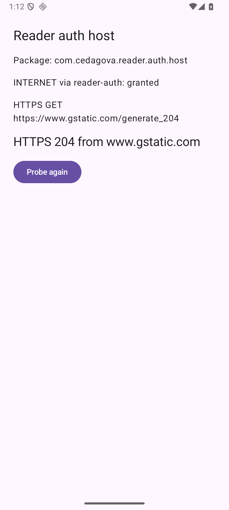
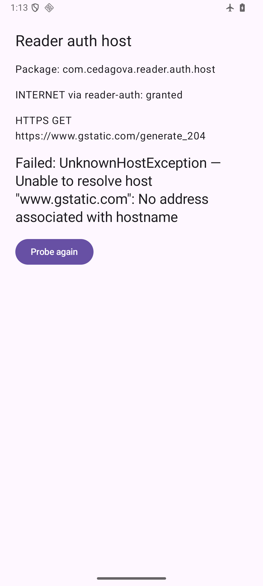

# The Reader auth host beside FastReader, on a device (#92)

Everything here was captured on **`Phone_Mid_API36`** (the reference AVD:
1080p, Android 16, 420 dpi) in one session on 2026-09-12, from
`./gradlew :reader-auth-host:installDebug` of
**`48ecf1b0b518f7d2f18a4a1cc820a5c0ea215374`** — the commit that adds the two
modules, and the parent of the commit that adds these files. FastReader
(`com.cedagova.fastreader`) was already installed on the AVD from an earlier
session and was not touched.

## The probe, online

`adb shell am start -n com.cedagova.reader.auth.host/.MainActivity`, six
seconds, screencap. The screen names the package, reports that `INTERNET`
arrived through the merged manifest, and shows the one HTTPS `GET`'s result —
`204` is the documented answer of `https://www.gstatic.com/generate_204`:

Logcat carries the same two lines under the `ReaderAuthHost` tag and
`AndroidRuntime:E` is empty; `pm list packages` lists the host and FastReader
as two packages. All three are in
[device-run-phone-mid-api36.txt](device-run-phone-mid-api36.txt).

## The probe, without a network

The plan's edge behaviour: an unreachable endpoint must show its reason and
must not crash or retry in a loop. `adb shell cmd connectivity airplane-mode
enable`, tap **Probe again**, eight seconds, screencap:

The process kept its pid, `AndroidRuntime:E` stayed empty, and logcat shows
exactly one further attempt (`attempt=1`) — the button is the only way to
probe again. Airplane mode was disabled afterwards.

## The two manifests, read off the APKs

[aapt2-host-manifests.txt](aapt2-host-manifests.txt) is `aapt2 dump` on the
unsigned release APK (`:reader-auth-host:assembleRelease`) and on the debug
APK from the same commit. The release manifest requests
`android.permission.INTERNET` (merged in from `:reader-auth`) plus only the
self-permission Android adds for its own broadcast plumbing, sets
`allowBackup=false` with both rule files, and has **no** `networkSecurityConfig`
attribute and no `network_security_config` resource. The debug manifest has
the attribute, and the configuration it points at forbids cleartext in its
base config and permits it for exactly one domain, `10.0.2.2`, without
subdomains.

The FastReader side of the same acceptance — the release dry run printing
`no INTERNET permission, minSdk 26, version matches version.properties` on
`app/build/outputs/apk/release/fastReader-1.5.0.apk` — is recorded on the PR.
