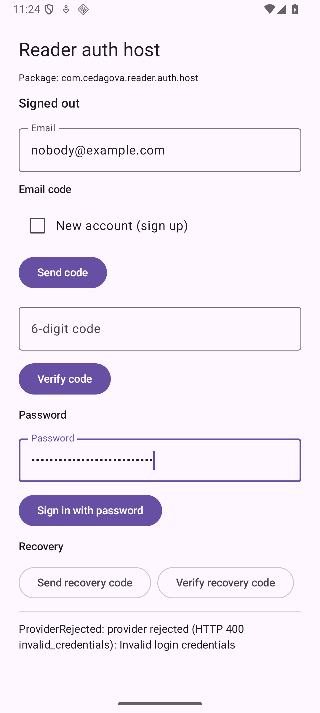

# The Reader auth host against stage, on a device (#93)

Captured on **`Phone_Mid_API36`** (1080p, Android 16, 420 dpi) on 2026-09-13
from `./gradlew :reader-auth-host:installDebug` of
**`d9fdb7e7bd5fa0292cd4d0b245504071024d40d5`** — the reviewed code head of
PR #99 — with the three stage values (`reader.supabaseUrl`,
`reader.supabasePublishableKey`, `reader.apiBaseUrl`) in the untracked
`local.properties`. No value is reproduced here.

## What was proven on the device

Two things the unit tests cannot: that the host reaches stage reader-api and
the stage identity provider through the module's real wiring, and that a
build without the values refuses at runtime.

1. **Signed-out form** — `adb shell am start -n
   com.cedagova.reader.auth.host/.MainActivity`, four seconds, screencap:

   

2. **Stage bootstrap and the provider's answer** — `nobody@example.com` and a
   wrong password typed with `adb shell input text`, **Sign in with password**
   tapped. The module first fetched stage `GET /v1/reader/pre-auth` and its
   wiring guard passed (a mismatch would have shown `ConfigurationMismatch`
   before any provider call), then the stage provider's `password` grant was
   rejected and mapped to the contract's provider-rejection branch:

   

   Logcat under `ReaderAuthHost` carries the same line and `AndroidRuntime:E`
   is empty; see [device-run-phone-mid-api36.txt](device-run-phone-mid-api36.txt).

3. **Not configured** — the same head built with no `reader.*` value (the
   hosted runner's situation), installed with `adb install -r`, launched:

   

   Logcat: `package=com.cedagova.reader.auth.host configured=false`.

## What was deferred, by owner decision (2026-09-13)

The plan's stage acceptance run — sign-up and sign-in with an emailed
six-digit code, `GET /v1/reader/capabilities` shown on screen, the session
surviving `am force-stop` and `adb reboot`, sign-out leaving
`no_backup/reader-auth/` without `session.bin`, and the backup/transfer
transcript per `docs/evidence/46/` — needs a person to relay the emailed code.
The owner chose to merge without that evidence and to run the test on stage
themselves ("merge without evidence — owner will test on stage"). Until that
run, the real `AndroidKeyStore` cipher path, the stage email template's code
delivery, reboot survival and the backup exclusion of the live store are
unproven on a device; the unit tests prove the store and refresh rules with a
fake cipher, and the host's nine-domain exclusion rules are the ones proven
for FastReader in `docs/evidence/46/`.

The steps to run it are in `docs/agent-first-development.md` ("Host sign-in
run against stage").
